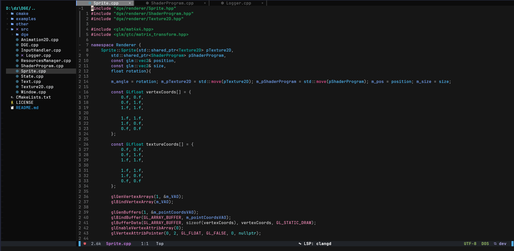

# Nvim config

This simple neovim config

----

## Dependencies
* C compiler for `nvim-treesitter`
* NodeJS
* Neovim `>=0.11`
* Git
* ripgrep

### How install
* Clone repo to neovim config folder `git clone https://github.com/DKaN01/MyNvimConfig.git <config folder>`
    * `AppData/Local/nvim` windows
    * `~/.config/nvim` unix
* Launch neovim and `lazy` installed plugins

----

#### Other
Keymap write in `lua/keymaps.lua` 
Plugin list in `lua/plugins.lua` 
***Bro just see files***
